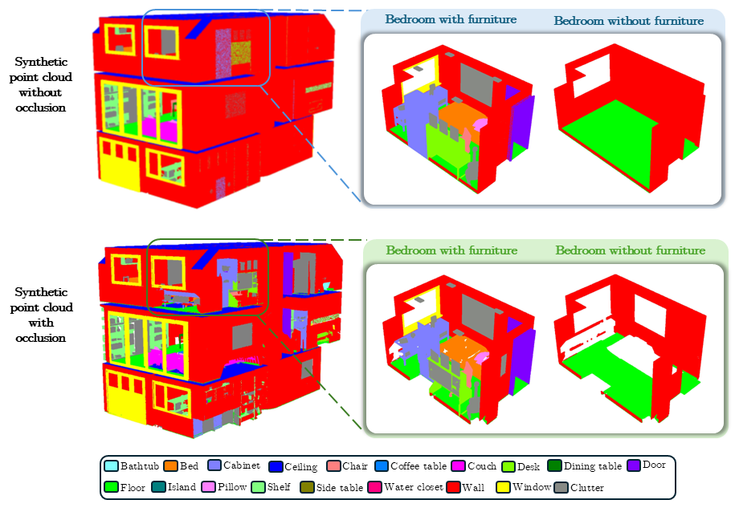

  
  
  <h3 align="center"><strong>BelHouse3D: A Benchmark Dataset for Assessing Occlusion Robustness in 3D Point Cloud Semantic Segmentation</strong></h3>

  

      <a href="https://scholar.google.com/citations?user=Opq90WAAAAAJ" target='_blank'>Umamaheswaran Raman Kumar</a>1&nbsp;&nbsp;&nbsp;
      <a href="https://scholar.google.com/citations?user=nTVNKgwAAAAJ" target='_blank'>Abdur Fayjie</a>1&nbsp;&nbsp;&nbsp;
      <a href="" target='_blank'>Jurgen Hannaert</a>2&nbsp;&nbsp;&nbsp;
      <a href="https://scholar.google.com/citations?user=zwa-3rYAAAAJ" target='_blank'>Patrick Vandewalle</a>1
       
  1KU Leuven&nbsp;&nbsp;&nbsp;
  23Frog
  

