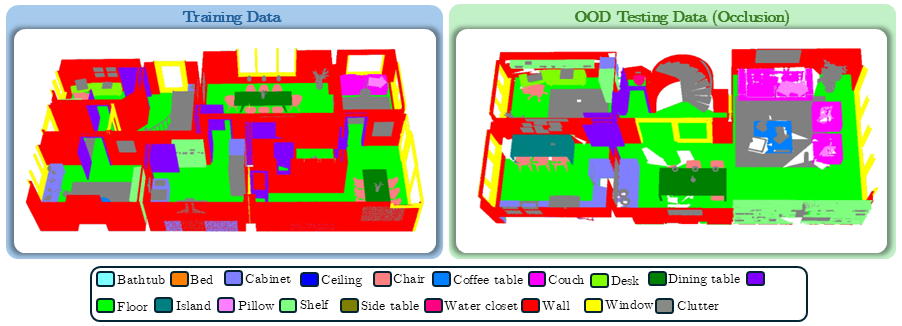

<p align="center">
  
  <h3 align="center"><strong>BelHouse3D: A Benchmark Dataset for Assessing Occlusion Robustness in 3D Point Cloud Semantic Segmentation</strong></h3>

  <p align="center">
      <a href="https://scholar.google.com/citations?user=Opq90WAAAAAJ" target='_blank'>Umamaheswaran Raman Kumar</a><sup>1</sup>&nbsp;&nbsp;&nbsp;
      <a href="https://scholar.google.com/citations?user=nTVNKgwAAAAJ" target='_blank'>Abdur Fayjie</a><sup>1</sup>&nbsp;&nbsp;&nbsp;
      <a href="" target='_blank'>Jurgen Hannaert</a><sup>2</sup>&nbsp;&nbsp;&nbsp;
      <a href="https://scholar.google.com/citations?user=zwa-3rYAAAAJ" target='_blank'>Patrick Vandewalle</a><sup>1</sup>
      <br>
  <sup>1</sup>KU Leuven&nbsp;&nbsp;&nbsp;
  <sup>2</sup>3Frog
  </p>

  

  <details>
    <summary>
    <font size="+1">Abstract</font>
    </summary>
    Large-scale 2D datasets have been instrumental in advancing machine learning; however, progress in 3D vision tasks has been relatively slow. This disparity is largely due to the limited availability of 3D benchmarking datasets. In particular, creating real-world point cloud datasets for indoor scene semantic segmentation presents considerable challenges, including data collection within confined spaces and the costly, often inaccurate process of per-point labeling to generate ground truths. While synthetic datasets address some of these challenges, they often fail to replicate real-world conditions, particularly the occlusions that occur in point clouds collected from real environments. Existing 3D benchmarking datasets typically evaluate deep learning models under the assumption that training and test data are independently and identically distributed (IID), which affects the models' usability for real-world point cloud segmentation. To address these challenges, we introduce the BelHouse3D dataset, a new synthetic point cloud dataset designed for 3D indoor scene semantic segmentation. This dataset is constructed using real-world references from 32 houses in Belgium, ensuring that the synthetic data closely aligns with real-world conditions. Additionally, we include a test set with data occlusion to simulate out-of-distribution (OOD) scenarios, reflecting the occlusions commonly encountered in real-world point clouds. We evaluate popular point-based semantic segmentation methods using our OOD setting and present a benchmark. We believe that BelHouse3D and its OOD setting will advance research in 3D point cloud semantic segmentation for indoor scenes, providing valuable insights for the development of more generalizable models. 
  </details>

</p>


## Outline
- [Data Preparation](#data-preparation)
- [Benchmark](#benchmark)
- [License](#license)
- [Citation](#citation)

## Data Preparation
Please download [BelHouse3D dataset](https://rdr.kuleuven.be/dataset.xhtml?persistentId=doi:10.48804/ZS8D6K) and organize them as following:

```
code_root/
└── data/
    └── belhouse3d/
        ├── raw/
          ├── belhouse3d_classnames.txt
        	├── IID-nonoccluded/
          └── OOD-occluded/
        └── processed/
          ├── fsl/
            ├── test/
              ├── IID-nonoccluded/
              └── OOD-occluded/
        	
```

## Benchmark

### Fully Supervised 3D Segmentation

### Few-Shot 3D Segmentation

## License

This project is released under the [MIT license](./LICENSE).


## Citation
If you find this work helpful, please consider citing:

```bibtex

```

```bibtex

```
